# PMR-FRN-SvxLink
FRN network with SvxLink on PMR

## 🔗 Povezava do navodil za namestitev programske opreme:
  - ### [Koraki za namestitev programske opreme](Navodila/RPi3-glavna-navodila.md)

## Discord skupina: PMR Slovenija

## PMR/FRN Povezave

  - [Slo-Tech forum](https://slo-tech.com/forum/t796344/0) (Prvi Redni PMR446 SKED V Sloveniji)

  - 

## 🧩 Predpogoji za postavitev SvxLinka

- Računalnik s povezavo v internet (npr Raspberry PI)
  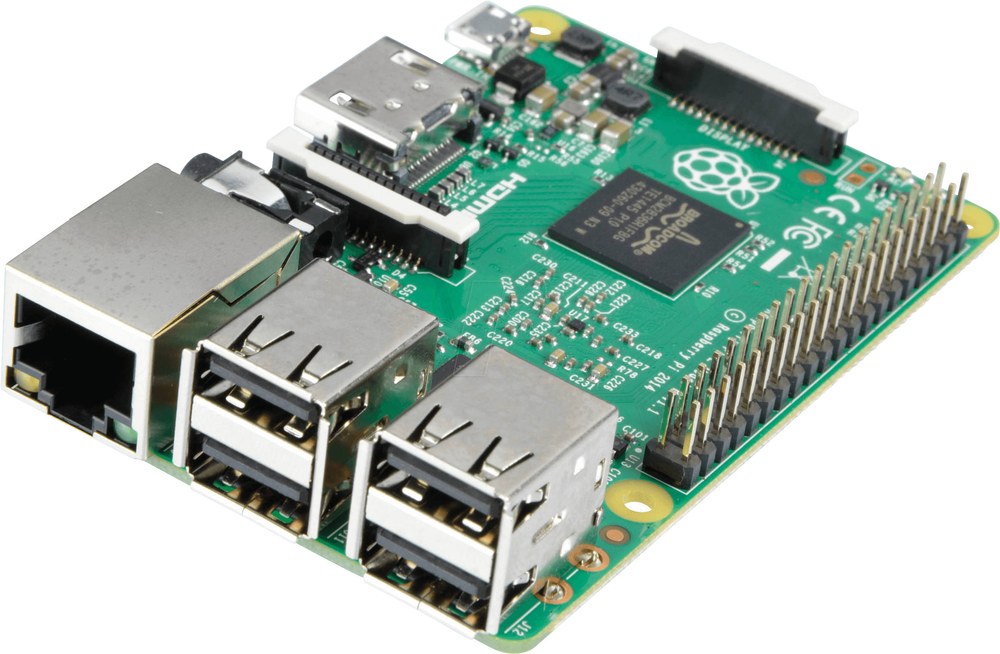
- vmesnik, da lahko povežeš željeno PMR postajo na ta računalnik (npr AIOC)
  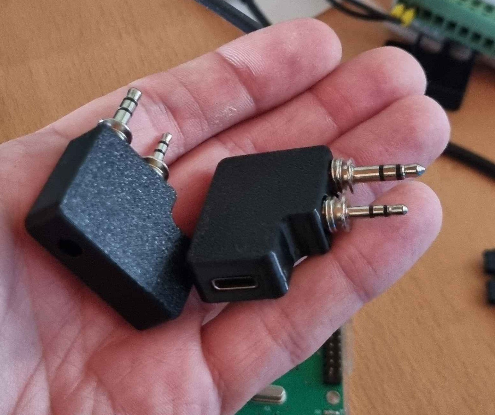
- Radijsko postajo z anteno
- Napajanje za računalnik in radijsko postajo

## 📷 Kako zgleda FRN prehod?
Primeri prehodov:
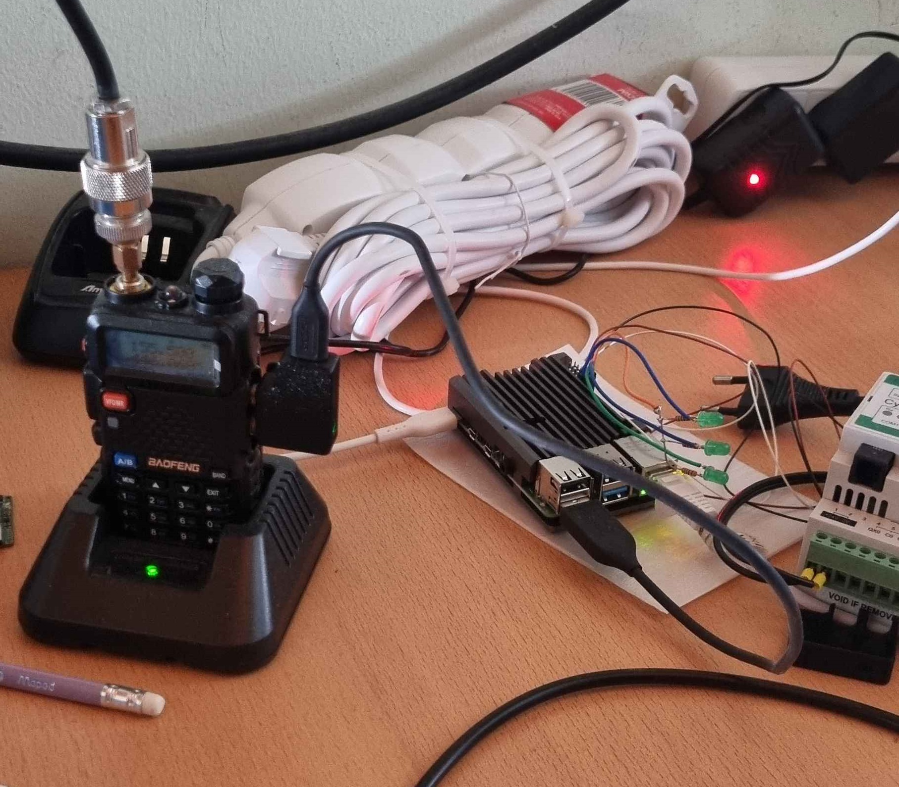
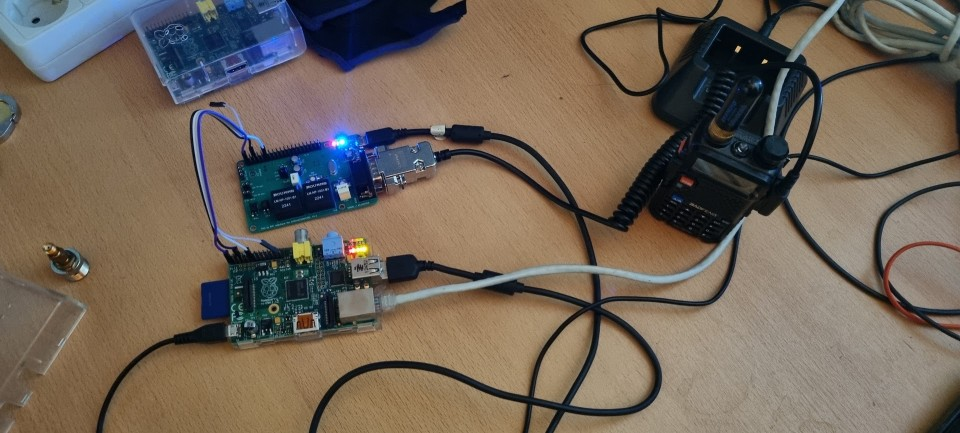

Ali moj prvi prehod na protobordu (2. 7. 2023) na JavaFRN Windows klientu:
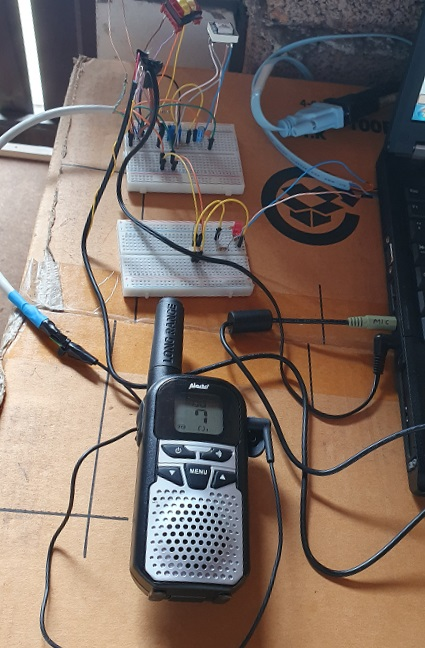

Evgenov prehod:
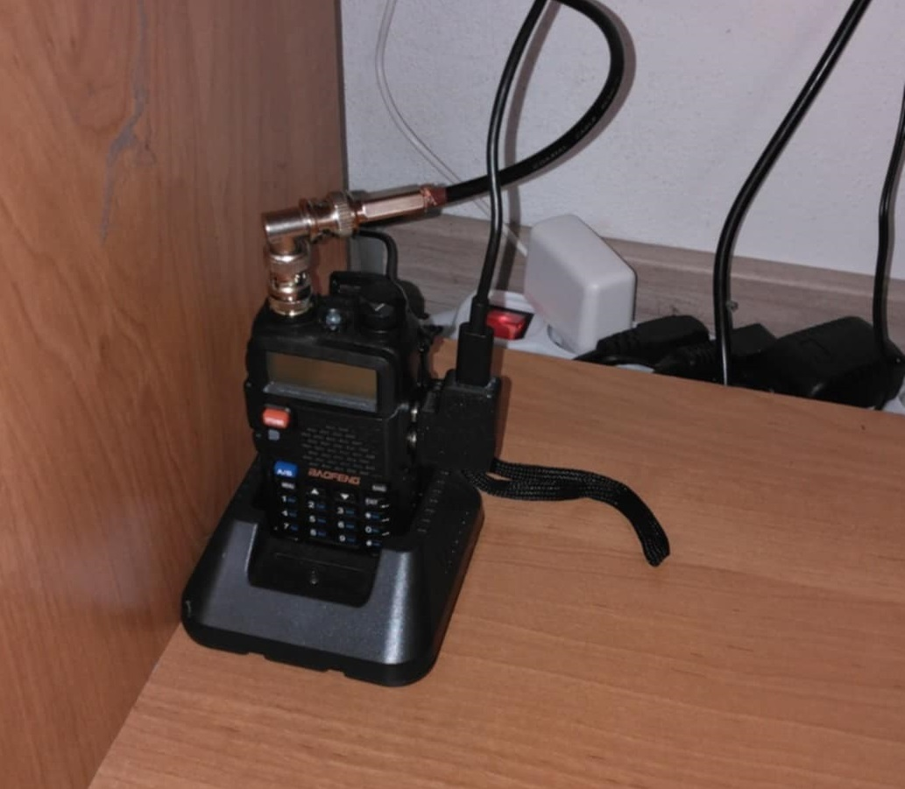

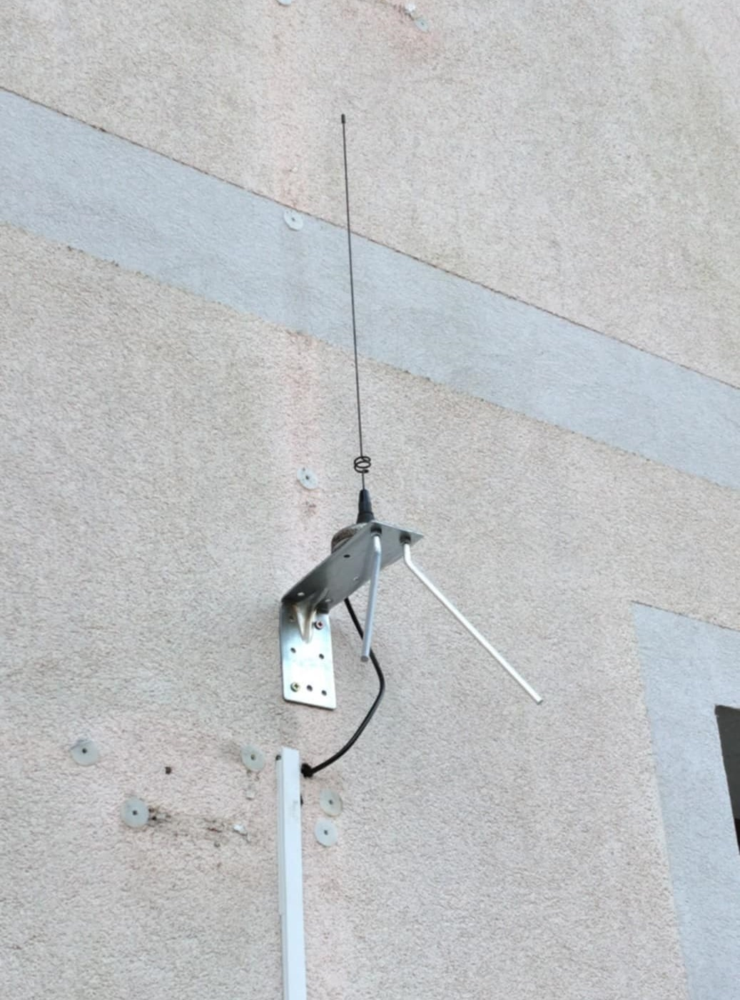

Profesionalni FRN prehod:
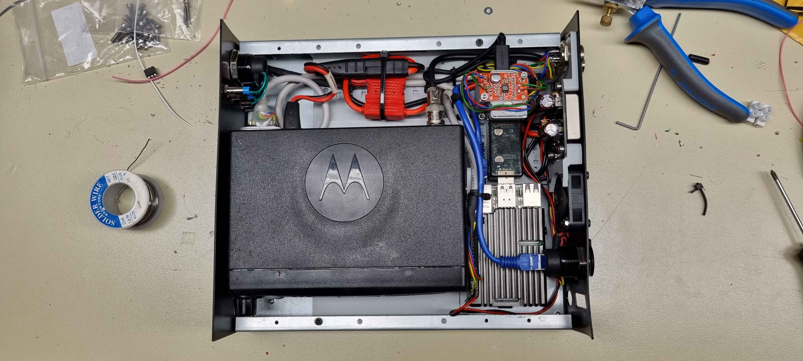

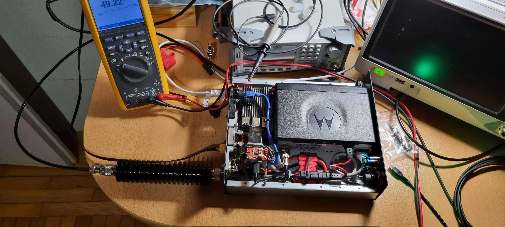

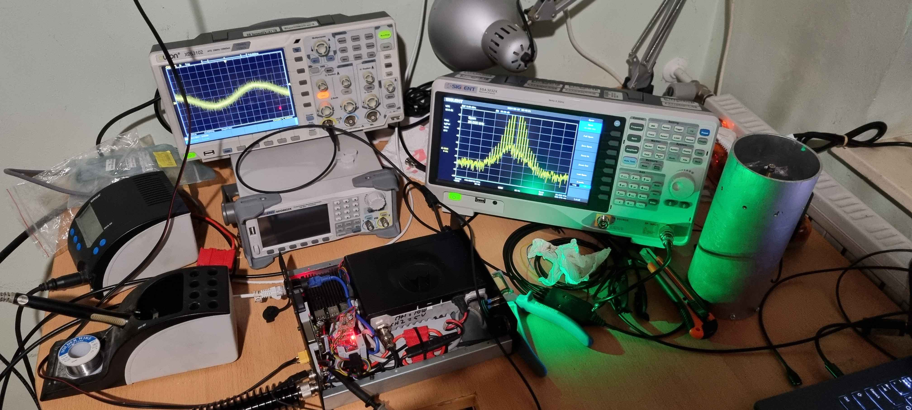

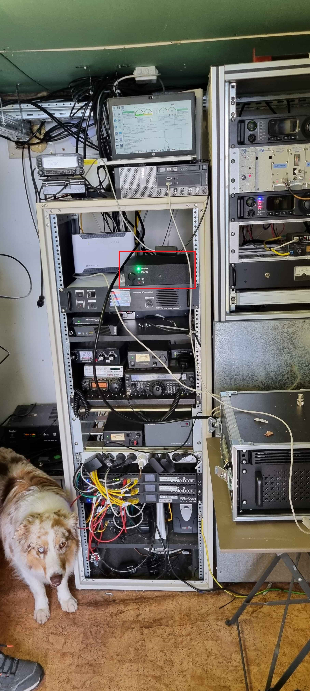

# Povezava do navodil za namestitev programske opreme:
- ### [Navodila za namesitev FRN prehoda na sistemu SvxLink](Navodila/RPi3-glavna-navodila.md) 

## Zahvale
@Žiga 
@Tilen 
@Franc (Radovljica) 
... **TODO - Dodati še vse ostale**

Datum: 12/2024 

[@Tomaz1](https://github.com/tomaz1) - priprava navodil.
